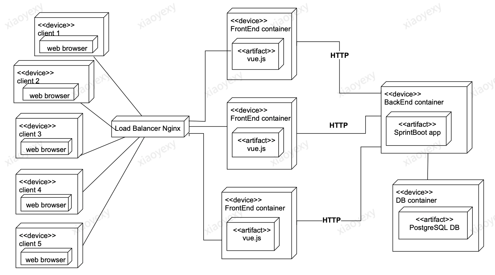

# Streaming Platform Management Sysyem

It's an interactive web application for different users to track the different offerings from various streaming services,as well as how these offerings are being accessed by different demographic groups of consumers, and display usage measurements for the various services.


## Deployment Diagram

   

## Quickstart
```
docker build -t gatech/backend -f ./images/Dockerfile.backend ./backend
docker build -t gatech/web -f ./images/Dockerfile.web ./web
docker build -t gatech/nginx -f ./images/Dockerfile.nginx ./nginx
docker-compose -p gatech -f docker-compose.yml up -d
```


## Web(Frontend)
We have a single nginx service deployed on port 3000, which plays a load balance role to split input request to three different frontend servers(port 3001,3002 and 3003).
All three front end servers send requests and receive data from our backend server. The backend server is implemented using Spring Boot framework. 
The front end and back end use REST api to communicate. All data is stored in postgres DB.   
You should be able to navigate to [http://localhost:3000](http://localhost:3000) to view the front end page.

## Backend
Our backend is a simple REST controller. Users can only access the front end page. All communication between frontend and backend use REST api. 
The backend use a postgres db to store data and manage Streaming service information.

## Database
The database is postgres 9.6.12. 

## Maven 
This project uses [Apache Maven](https://maven.apache.org/) to manage itself. 
You will see the dependencies defined in `/backend/pom.xml`, and the maven commands called by the backend's Dockerfile

